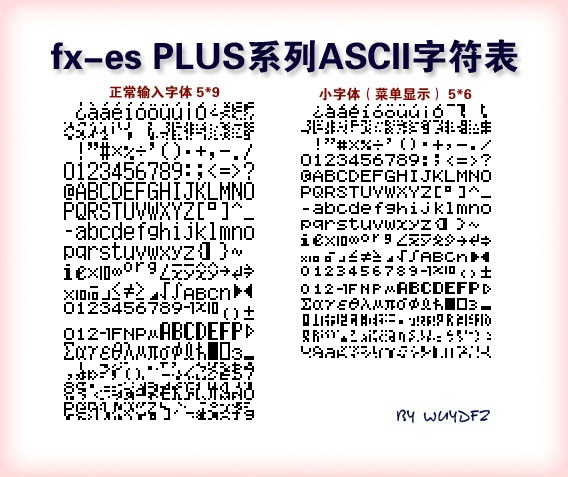
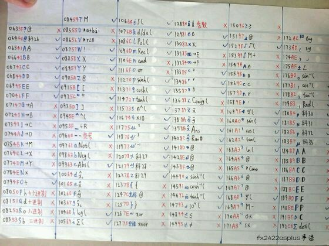
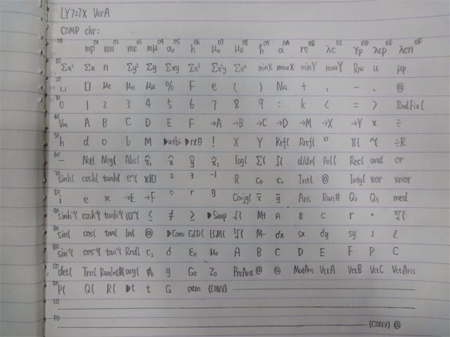

# Character set

Character sets may vary by model (notably, PLUS A versions will contain Simplified Chinese messaging) but will generally function similarly. Characters can either be 5x9 height or 5x6 height on the display.

## fx-ES PLUS character fonts

Source: https://community.casiocalc.org/topic/7583-fx-82-83gt-115-991es-plus-hacking/page-9#entry61629

## fx-82ES PLUS character map

Source: https://tieba.baidu.com/p/3109175967?pid=52273856647&pn=0&&red_tag=i3044162056

## LY727X VerA character map

The LY727X is likely a variant of the fx-82ES PLUS II.

Source: https://community.casiocalc.org/topic/7583-fx-82-83gt-115-991es-plus-hacking/

## fx-991ES character map

Upscaled using waifu2x.

Source: https://tieba.baidu.com/p/2793407170?pn=1
