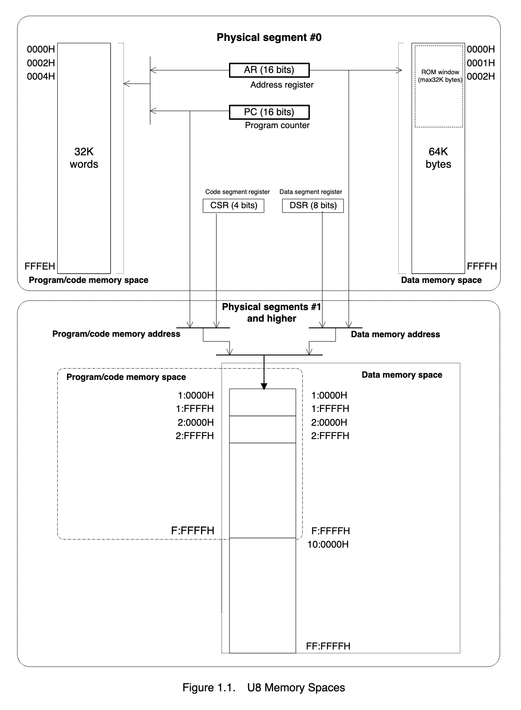
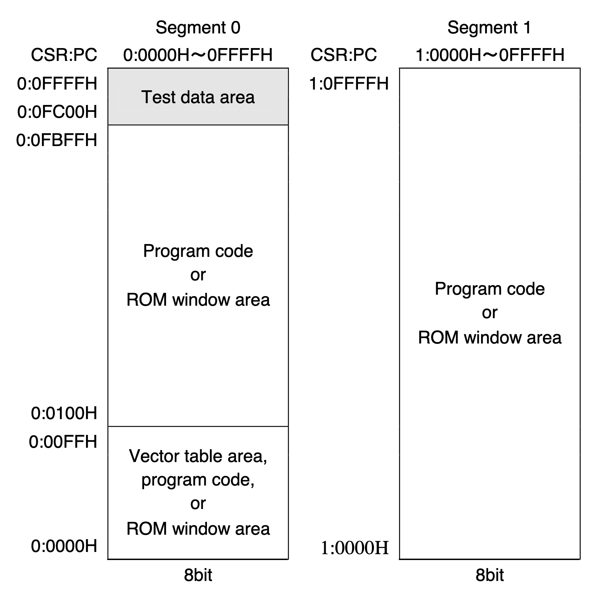
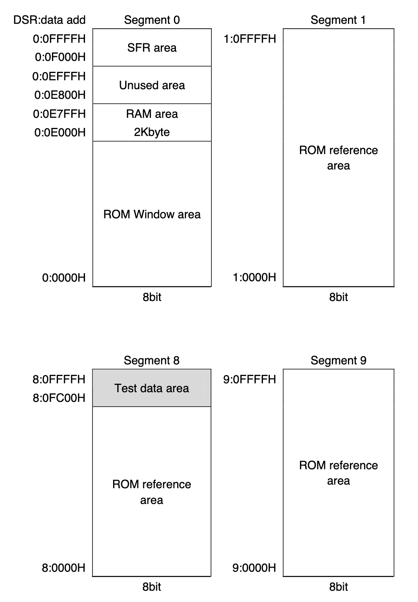

# Introduction

The CASIO fx series of calculators are a subset of CASIO's scientific calculators, which have been sold and distributed globally since 2004.

The **fxesdev** project is dedicated to exploiting and reverse engineering non-programmable CASIO calculators. We currently focus the following calculators as a base development environment, but our research can be applied to almost all regional and feature model variations:

- fx-82ES PLUS II
- fx-570ES PLUS
- fx-991ES PLUS

## Feature guide

### Modes

These calculators are scientific calculators which can perform numerous operations and use live prettyprinting (which CASIO calls a _Natural-V.P.A.M_). Depending on the model, some features may only be available on some calculators. Generally, the calculator will have a number of modes in which it can be used, that may vary by model and region. For example, on an fx-100AU PLUS, there are six modes:

    1:COMP  2:CMPLX
    3:STAT  4:BASE-N
    5:VERIF 6:VECTOR

These modes can come in useful for basic exploits (e.g basic overflow, [Mode 68](mode-68)). There are also two different input/output formats (MathIO and LineIO) which alter whether text is prettyprinted, which can also help basic exploits.

### Unstable character

The unstable character is currrently the most common way of loading any character from the [character set](character) into memory. It will increment through the set with every cursor movement, allowing virtually any character to be inputted, albeit through a time-consuming manual process.

## Hardware guide

### CPU

The primary microcontroller in these calculators is the **nX-U8/100** by Lapis Semiconductor (formerly OKI Semiconductor), an 8-bit low-power CMOS MCU. We would highly recommend you read the [Core Instruction Manual](https://github.com/fxesdev/nXU8100-resources/blob/main/nX-U8100%20Core%20Instruction%20Manual.pdf) in addition to this light introduction.

?> More useful resources (including the core instruction manual) relating to the nx-U8/100 is available at [fxesdev/nXU8100-resources](https://github.com/fxesdev/nXU8100-resources/). Specifications were officially released [here](https://github.com/fxesdev/nXU8100-resources/blob/main/nXU8100-datasheet-translated.pdf) but may be outdated.

#### Architecture

?> We use zero-indexing.

There are two address spaces:

- Instructions: 1MB
- Data: 16MB

Unlike the 6502 or the x86 architecture (which use the von Neumann architecture), the nX-U8/100 is a **Harvard** architecture. Effectively, the nX-U8/100's Harvard architecture:

- has separate instruction and data busses
- has the first physical memory segment point to different locations for instructions vs data

Hence, the only writeable area is RAM (located at segment #1). However:

- at segment #1 via the instruction bus, a full map of the ROM is present, hence, any `pop pc` to address within RAM will only point to ROM instructions.
- therefore, arbitrary code execution (ACE) is not possible

However, what _is_ possible is return-oriented programming, the next best thing. See [ROP](rop).

#### Segmentation

Each address space is divided into 64-kilobyte physicl segments. However, there are two abstract types of segments:

> Source: p.12 [nX-U8/100 Core Instruction Manual](https://github.com/fxesdev/nXU8100-resources/blob/main/nX-U8100%20Core%20Instruction%20Manual.pdf)

##### Segment #0
Segment #0 (0:0x0000 - 0:0xFFFF) is special because it contains the ROM window, and has:

- two sets of addresses (with separate registers for accessing each)
- 32 kiloword code memory segment (accessed with the program counter `pc`)
- 64 kilobyte data memory segment (accessed with the address register `ar`)

If the address in `ar` is within the ROM window, the register will access instructions, not data.

The data memory access layout can be represented as:

    code: 32K ROM window
    data:
        - 32K of ROM
        - 32K of ram
        - 64K

##### Segment #n

In segment #n, where n => 1:

- single address space with both instructions and data
- 20-bit address (`CSR:pc`) where:
    - 4 bits is from CSR
    - 16 bits is from `pc`
- physical segment for data
- 24-bit address (`DSR:ar`) where:
    - 8 bits is from DSR
    - 16 bits is from `ar`

?> CSR = code segment register; DSR = data segment register

##### Chip-specific memory

However, be warned... while the CPU has defined how memory data is accessed for each segment (through addresses and registers), this does not necessarily mean there is a single memory layout. **Memory layouts are chip-specific** and in a large model, you may have a layout such as this one represented within the ML610Q380/ML610Q383/ML610Q384/ML610Q385.

###### Example of a Program Memory Space (for instructions)

>Source: p.35 [ML610Q380/ML610Q383/ML610Q384/ML610Q385 User's Manual](https://www.lapis-tech.com/en/data/user%27s%20manual-file_db/miconlp/FEUL610Q380-01.pdf)

###### Example of a Data Memory Space (for data)

>Source: p.36 [ML610Q380/ML610Q383/ML610Q384/ML610Q385 User's Manual](https://www.lapis-tech.com/en/data/user%27s%20manual-file_db/miconlp/FEUL610Q380-01.pdf)

## Critically useful resources

This documentation complements already-existing development community forums and information:

- [casiocalc wikidot](http://casiocalc.wikidot.com/)
- [casiocalc forum thread](https://community.casiocalc.org/topic/7583-fx-82-83gt-115-991es-plus-hacking/)
- [Baidu Tieba forum](https://tieba.baidu.com/f?kw=fx-es%28ms%29&ie=utf-8)

These GitHub repositories are highly useful:

- [Itay2805/fx991es-hacking](https://github.com/Itay2805/fx991es-hacking/)
- [user202729/fxesplus](https://github.com/user202729/fxesplus)